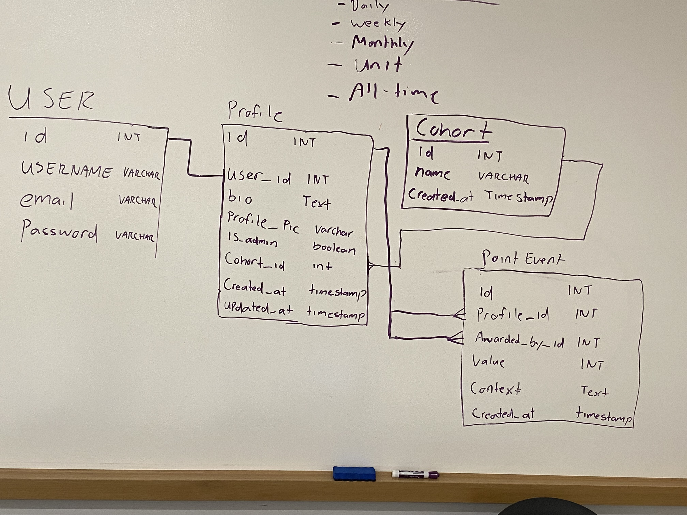
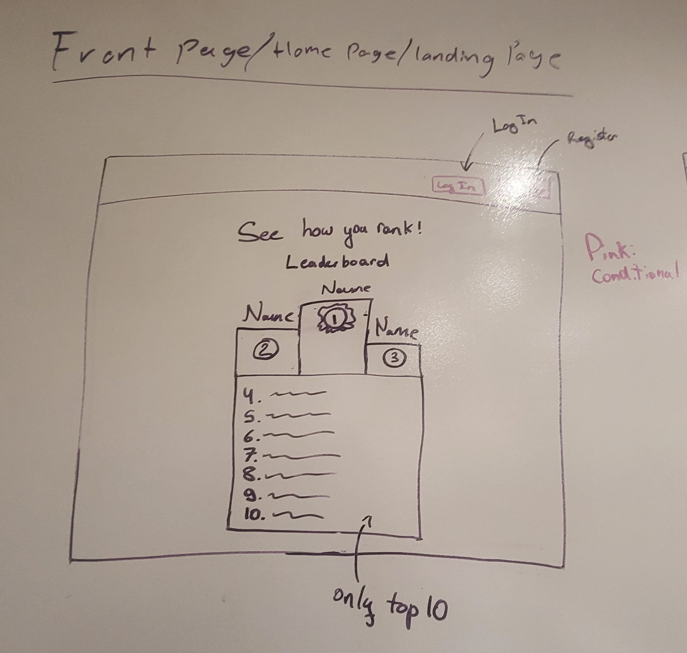
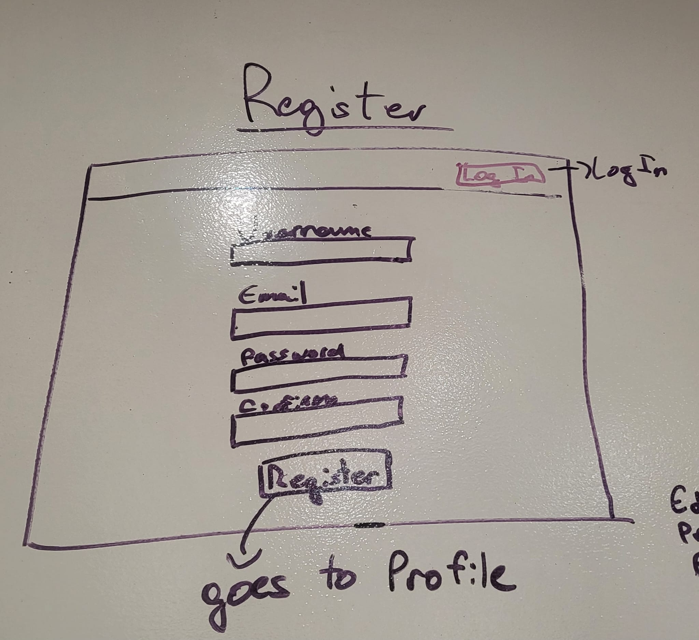
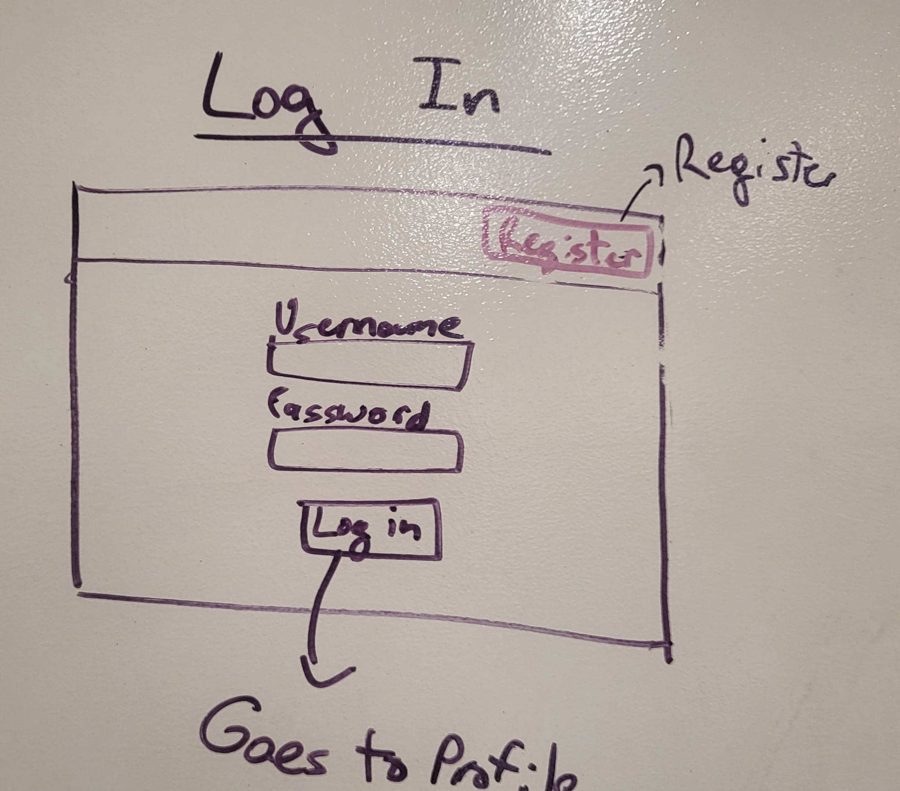
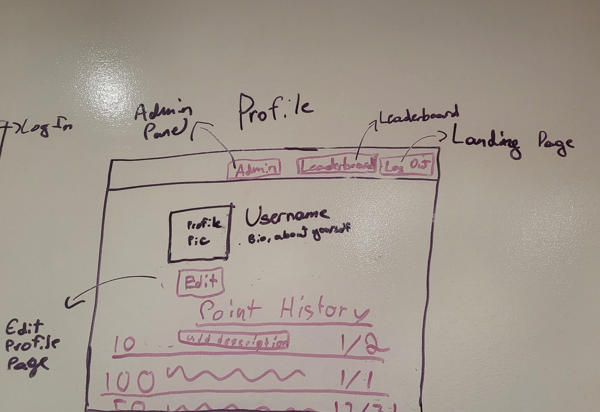
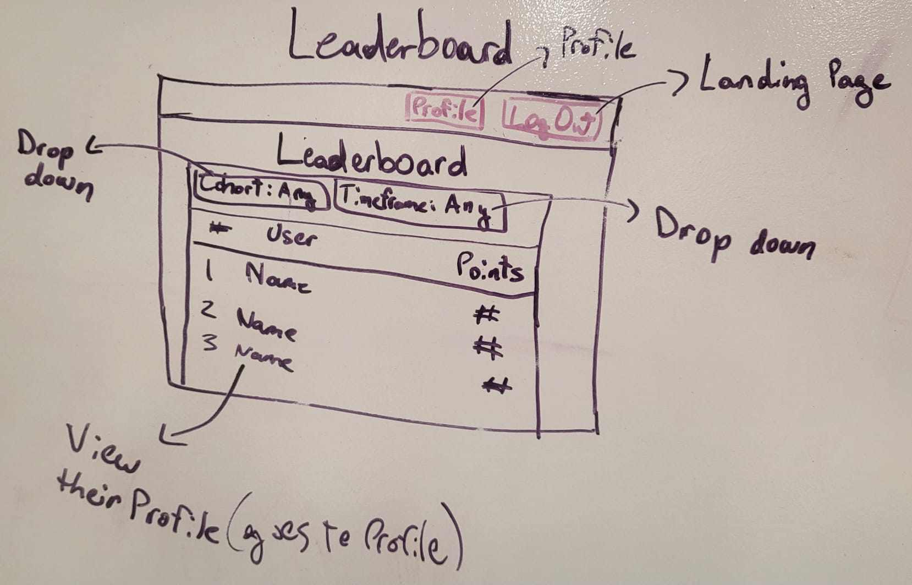
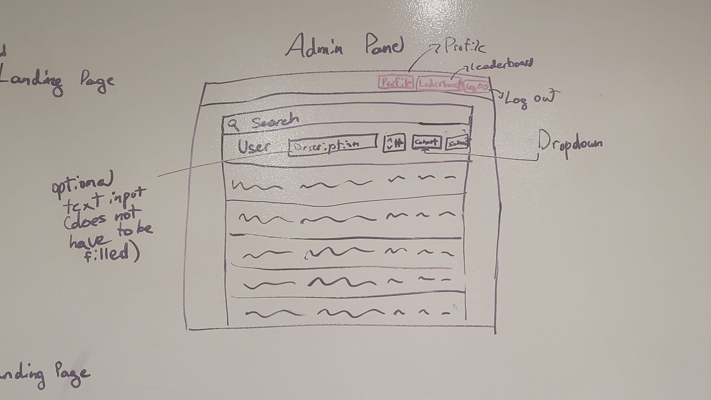
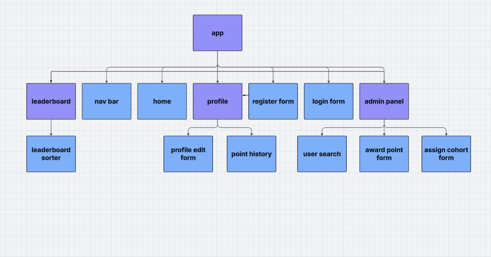

# Proposal: Raul's Points Tracker

## MVPs / User Stories
### Non Admin
- As a user, I want to register for an account, so that I can log in and track my points.
- As a user, I want to log in using a username and password.
- As a user, I want to view my total points on my profile.
- As a user, I want to view my full point history with optional context and timestamps.
- As a user, I want to update my profile info (username, bio, password, profile pic).
- As a user, I want to view the leaderboard to compare my points with others.
- As a user, I want to view only my cohort’s leaderboard to compare fairly.

### Admin
- As an admin, I want to assign users to cohorts.
- As an admin, I want to give points to any user (optionally with context).
- As an admin, I want to remove or edit a user’s point entry.
- As an admin, I want to view, search, and filter all users by cohort.

## ERD

## Route Table
### Public Routes
| http method | path             | purpose                                      |
|-------------|------------------|----------------------------------------------|
| post        | /users/register/ | register a user                              |
| post        | /users/login/    | login a user                                 |
| get         | /profile/:id/?LeaderBoard=trueOrFalse&Cohort=cohortName&TimeFrame=timeFrame    | indivdual user profile                       |
| put / delete       | /profile/:id/    | edit and delete a profile                               |
| get         | /profile/:id/point/ | shows user points |
| post        | /profile/:id/point/     | give user points (pass user id through body) |
| get         | /profile/       | get all users (query for set amount)         |

## Wireframes

## Component Hierarchy Diagram

### Timeline-Daily accountability
| Day       |   | Task                        | Blockers | Notes/Thoughts |
|-----------|---|-----------------------------|----------|----------------|
| Thursday  |   | Planning and brain storming
| Friday    |   | Propose and make adjustments hopefully start backenend
| Saturday  |   | Finish work from Friday and assistance from Raul
| Sunday    |   | Rest
| Monday    |   | Start Front End |          |                |
| Tuesday   |   | Work on Front End  |          |                |
| Wedensday |   | Finish Front End   |          |                |
| Thursday  |   | Test app and CSS and stretch goals          |          |                |
| Friday    |   | Present                |          |                |

## Stretch Goals
### User Stories
- As a user, I want to receive badges for milestones (e.g., 100 points).
- As a user, I want to leave positive shout-outs on other users’ profiles.
- As a user, I want to view my badge collection on my profile.
- As an admin, I want to filter leaderboards by cohort/date.
- As a user, I want to view all-time, daily, and cohort-specific leaderboards.
